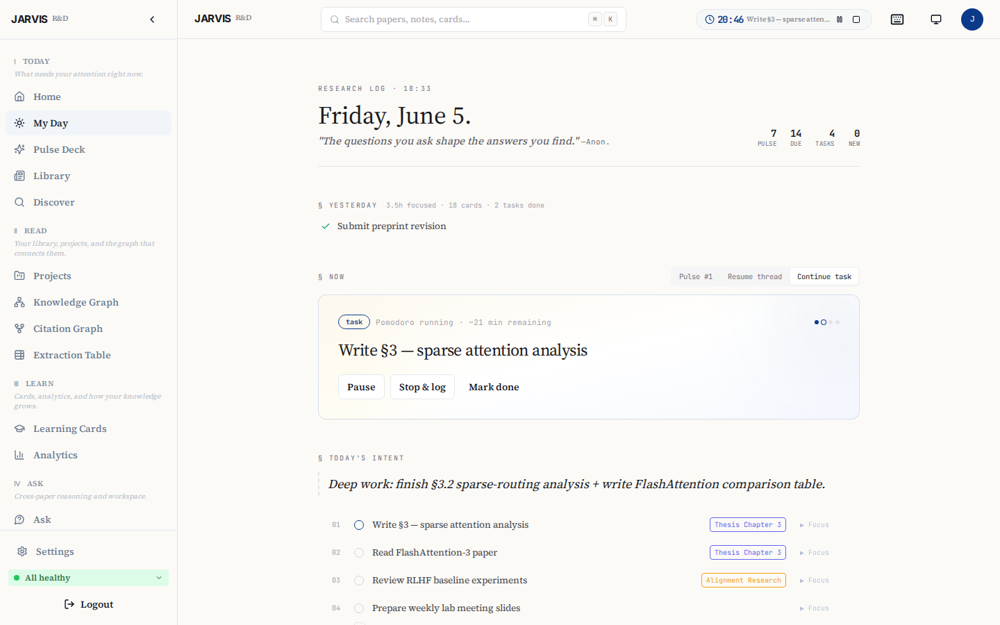
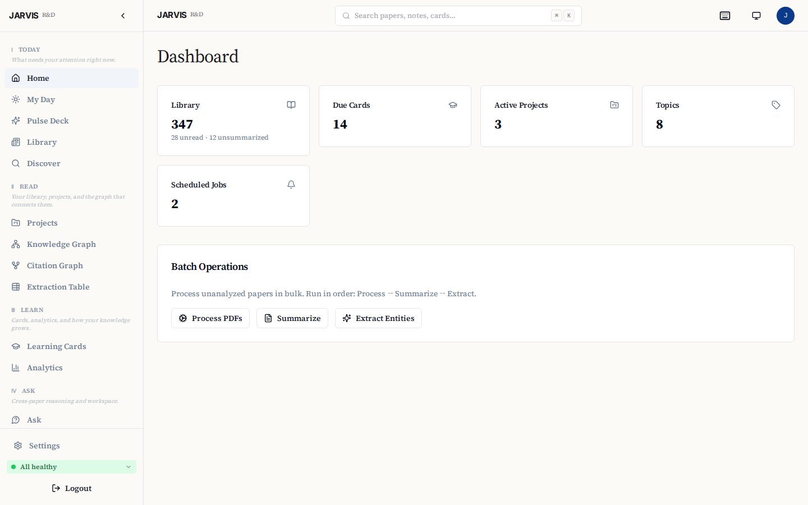
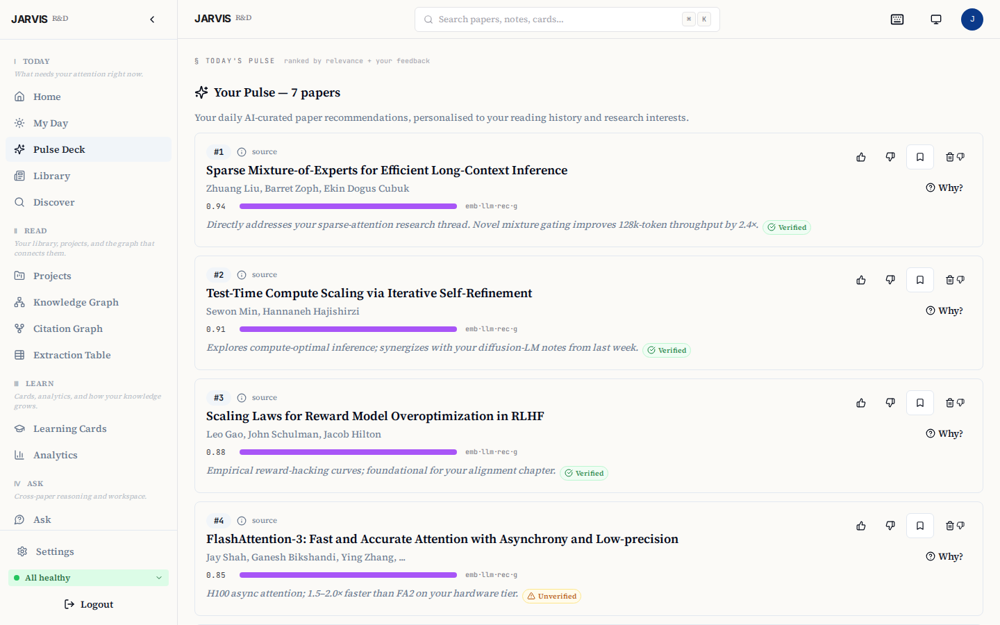
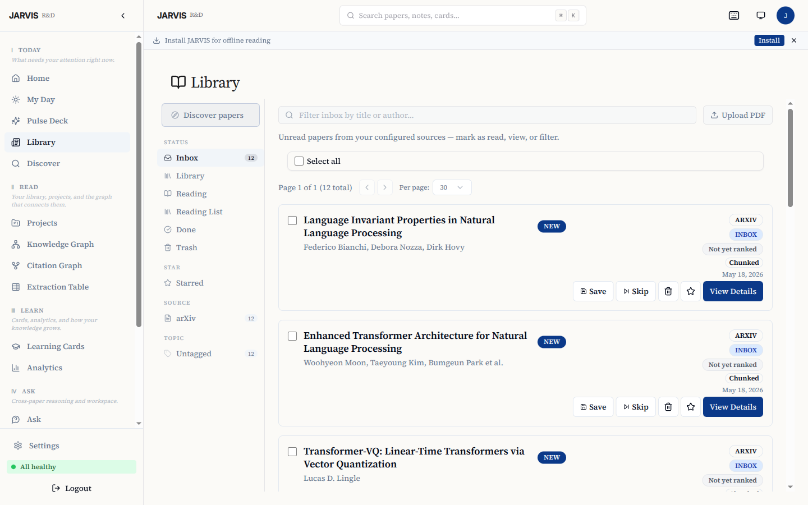
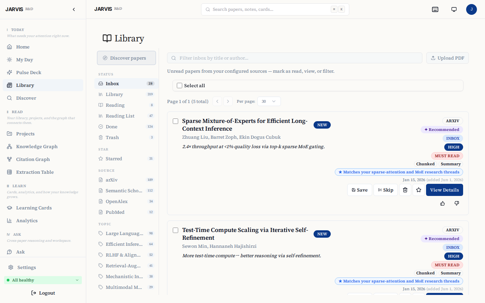
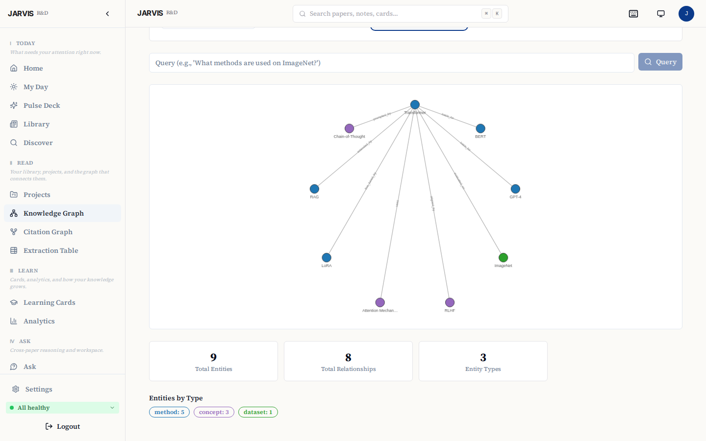

# JARVIS RD Assistant

> Self-hosted AI research assistant: citation-backed paper briefings, spaced-repetition learning, integrated project management. FastAPI + React + Postgres + Qdrant.

📖 **Docs:** https://ffidan.github.io/Jarvis-RD-Assistant/ &nbsp;·&nbsp; 📦 **Releases:** https://github.com/FFidan/Jarvis-RD-Assistant/releases &nbsp;·&nbsp; 🔒 **Security:** [SECURITY.md](SECURITY.md)

[](https://github.com/FFidan/Jarvis-RD-Assistant/actions/workflows/ci.yml)
[](https://github.com/FFidan/Jarvis-RD-Assistant/actions/workflows/docs.yml)
[](LICENSE)
[](https://www.python.org/downloads/)



## Highlights

- 📰 **Research Feed** — daily ranked briefings from arXiv, OpenAlex, Semantic Scholar, and PubMed, with per-topic Pulse digests delivered at the time you choose.
- 💬 **Ask** — cross-paper RAG over your library with inline citations and verified quote spans.
- 🧠 **Cards** — FSRS spaced-repetition for long-term retention of paper findings.
- 📂 **Projects** — lightweight task + milestone tracking tied to source papers, with optional Zotero push.

<details>
<summary><b>More screenshots</b> — Dashboard · Pulse · Library · Discover · Knowledge Graph</summary>

| Dashboard | Pulse Deck |
|---|---|
|  |  |
| **Library (inbox)** | **Discover (multi-source)** |
|  |  |
| **Knowledge Graph** | |
|  | |

</details>

## Quickstart

```bash
git clone https://github.com/FFidan/Jarvis-RD-Assistant.git
cd Jarvis-RD-Assistant
./setup.sh --check   # preflight (read-only, exits 0 on pass)
./setup.sh
```

`setup.sh` generates strong random secrets, configures TLS, brings the Docker Compose stack up, and waits for the dashboard to be reachable. Then open **http://localhost:3001** — the first-run wizard creates the first admin account; no pre-existing credentials required.

`setup.sh` asks whether this is a solo install or a team instance (`--mode single|multi`). Single-user logs in via `JARVIS_API_KEY` with no SMTP dependency; multi-user uses email magic-links and needs an SMTP relay. See [docs/DEPLOYMENT.md](docs/DEPLOYMENT.md#single-user-vs-multi-user-mode) for the trade-off.

**Non-interactive (CI / cloud-init):**

```bash
# Local dev / CI smoke test
./setup.sh --non-interactive --profile=dev

# Self-signed HTTPS (home lab)
./setup.sh --non-interactive --domain=jarvis.local --profile=local-https

# Let's Encrypt (public server)
./setup.sh --non-interactive --domain=jarvis.example.com \
  --admin-email=ops@example.com --profile=letsencrypt \
  --smtp-host=smtp.resend.com --smtp-user=resend \
  --smtp-pass-file=/run/secrets/smtp_pass
```

See `./setup.sh --help` for all flags. After the first admin exists, invite teammates at **Settings → Admin → Users**.

## What it does

JARVIS is designed for researchers who track multiple topics, read (or should read) dozens of papers per week, and want an assistant that does not hallucinate. It runs entirely on your own hardware with local LLMs via Ollama, or optionally routes to cloud providers (OpenAI, Anthropic, Gemini) through LiteLLM.

**Core subsystems:**

- **Research Pulse** — discovers papers from arXiv, Semantic Scholar, OpenAlex, and PubMed against your topics, downloads PDFs, chunks and embeds them for semantic search, then generates verified summaries with exact-quote backing and supports RAG-powered Q&A across your library.
- **Learning Engine** — generates flashcards from paper findings, schedules reviews using the FSRS spaced-repetition algorithm, and tracks retention analytics so insights stick.
- **Project Manager** — task and milestone tracking with paper-linking, deadline warnings, optional Zotero push when a paper is starred and linked to a project.
- **My Day** — triage dashboard that opens to today's counters (focus time, tasks due, cards due), a Pulse preview surfacing the 3 most-relevant new papers, a Pomodoro + task block, overdue / due-today action items, and Learning/Project summaries.
- **Pomodoro Timer** — wall-clock work/break timer with pause/resume, browser notifications, auto-logging of completed sessions, and a compact widget in the TopBar so the timer follows you between pages.
- **Discovery & Pulse** — overnight proactive discovery scores candidates against your research interests using embedding similarity plus LLM relevance ranking, then delivers a curated card deck each morning via the My Day preview and optional Telegram. Lightweight 👍/👎/💾 feedback shapes tomorrow's recommendations.
- **Save & Star** — lifecycle states (`inbox / to_read / reading / done / trash`) and an orthogonal `star` flag, surfaced in the Research Feed and exposed to the Telegram bot via `paper:save:<id>`.

### Design choices

- **Anti-hallucination pipeline.** Verified summaries, flashcard evidence, KG edges, Pulse reasoning, and RAG answer sentences are checked against retrieved source text. Weekly Summary separates verified from unverified themes. A conservative contradiction scanner persists only quote-backed conflicts.
- **Local-first.** Runs on Ollama with no cloud dependency. LiteLLM provides a unified gateway so you can swap between local and cloud models without code changes. See [docs/perf/2026-05-22-phase3-bench-rerun.md](docs/perf/2026-05-22-phase3-bench-rerun.md) for tier-by-tier model recommendations.
- **Hybrid search.** BM25 full-text search fused with Qdrant vector search via reciprocal rank fusion, then reranked with a cross-encoder for high-precision retrieval.

## Architecture

```
                         ┌─────────────────────────────────┐
                         │      React Dashboard (:3001)     │
                         │   nginx reverse proxy → backends │
                         └────────────┬────────────────────┘
                                      │
                    ┌─────────────────┼─────────────────┐
                    ▼                                    ▼
        ┌───────────────────┐              ┌───────────────────┐
        │  Paper Ingestion  │              │  Learning Engine  │
        │   FastAPI (:8000) │              │   FastAPI (:8001) │
        │                   │              │                   │
        │ • Paper discovery │              │ • Card generation │
        │ • PDF processing  │              │ • FSRS scheduling │
        │ • Embedding/RAG   │              │ • Review tracking │
        │ • Summarization   │              │ • Project mgmt    │
        │ • Knowledge graph │              │ • Analytics       │
        └──────┬────────────┘              └──────┬────────────┘
               │                                   │
    ┌──────────┼───────────────────────────────────┼──────────┐
    │          ▼              ▼            ▼       ▼          │
    │   ┌──────────┐   ┌──────────┐  ┌─────────┐             │
    │   │ Postgres │   │  Qdrant  │  │ LiteLLM │             │
    │   │  (:5432) │   │  (:6333) │  │ (:4000) │             │
    │   └──────────┘   └──────────┘  └────┬────┘             │
    │                                      │                  │
    │                                 ┌────▼────┐             │
    │                                 │  Ollama │             │
    │                                 │ (:11434)│             │
    │                                 └─────────┘             │
    │                    Docker network: jarvis                │
    └─────────────────────────────────────────────────────────┘
```

**Optional services:** n8n (workflow automation, `--profile n8n`), Telegram bot (`--profile telegram`), Langfuse LLM-trace observability (off by default — `make observability-up`; see [docs/contracts/04-observability.md](docs/contracts/04-observability.md)).

## Pick your path

JARVIS supports three audiences — pick the one that matches your situation.

### "I want to host this for myself" — solo self-host

The fastest path. Get JARVIS running on your own machine in one command, then finish configuration in your browser.

```bash
git clone https://github.com/FFidan/Jarvis-RD-Assistant.git
cd Jarvis-RD-Assistant

# Linux / macOS
./scripts/jarvis-setup.sh

# Windows (PowerShell)
.\scripts\jarvis-setup.ps1
```

The bootstrap script verifies Docker is installed, generates a fresh `.env` with strong random secrets (idempotent — never clobbers existing `.env`), starts the Docker Compose stack, waits for the dashboard to come up, and prints the URL.

Open **http://localhost:3001**. The first-run web wizard walks you through:

- A system check (Postgres, Qdrant, Ollama, LiteLLM reachability).
- SMTP relay (skippable — magic-link emails fall back to stdout in dev mode).
- Your **admin email** — creates your account and signs you in immediately, no email round-trip.
- Optional cloud LLM keys (OpenAI, Anthropic, Gemini).

First boot pulls ~14 GB of Ollama models (`qwen3:14b`, `qwen3:4b`, `qwen3-embedding:4b`) in the background; you can use the dashboard while they download. **Upgrading later:** `git pull && ./update.sh`.

> `./scripts/jarvis-setup.sh` defers all config to the web wizard. The top-of-README `./setup.sh` is equivalent but asks about LAN access mode and Telegram up-front in the shell instead. Pick whichever style you prefer; both produce the same Compose stack.

### "I'm joining a hosted JARVIS instance" — end-user

Your admin invited you. You don't need to install anything.

1. Open the invitation email from your admin.
2. Click the magic-link button (or paste the link into your browser). It expires after **24 hours** — ask for a re-send if it's lapsed.
3. You're signed in. The link does not need a password and does not need to be saved; future logins are also magic-link based.
4. Bookmark the dashboard URL. Future sign-ins: visit it and enter your email — JARVIS sends a fresh 15-minute magic link.

The first time you log in, the dashboard shows a guided onboarding tour: connect a paper source, define a topic, wait for Pulse to deliver your first card deck.

### "I'm running JARVIS for a small group" — admin operator

Same install path as solo, plus the operational concerns of running an instance other people depend on. After running `./scripts/jarvis-setup.sh`, walk through the checklist below.

#### 1. SMTP for magic-link delivery

Real users need real emails. The wizard's SMTP step accepts any standard relay. **Recommended free option: [Resend](https://resend.com)** — 3000 emails/month free, modern API, fast onboarding.

Resend SMTP credentials (paste into the wizard):

| Field      | Value                          |
|------------|--------------------------------|
| Host       | `smtp.resend.com`              |
| Port       | `465` (TLS) or `587` (STARTTLS) |
| Username   | `resend`                       |
| Password   | `re_...` (your Resend API key) |
| From       | `you@your-verified-domain.dev` |

Other supported relays: AWS SES, SendGrid, Postmark, Mailgun, your own postfix. Anything that speaks SMTP works.

#### 2. Reverse proxy + public TLS

Two common shapes:

- **Caddy + Let's Encrypt** (built-in, simplest). Set `LETSENCRYPT_DOMAIN` and `LETSENCRYPT_EMAIL` in `.env`, then `docker compose --profile letsencrypt up -d caddy`. Caddy auto-provisions and renews certs.
- **Cloudflare Tunnel** (zero open ports, requires a Cloudflare account). Set `CLOUDFLARE_TUNNEL_TOKEN` and run `docker compose --profile tunnel up -d`. Pair with Cloudflare Zero Trust access policies. **Always** set `JARVIS_TUNNEL_ACK_ZT_CONFIGURED=1` only after you've configured ZT access — without it your dashboard is publicly reachable.

Detailed walkthroughs in [docs/DEPLOYMENT.md](docs/DEPLOYMENT.md).

#### 3. Backups

```bash
# Encrypted nightly pg_dump → ./shared/backups/
docker compose --profile backup up -d
```

The `init-secrets.sh` script auto-generates `secrets/backup_encrypt_key.txt`. Keep it offline. Configure S3 upload (optional) via `BACKUP_S3_BUCKET`.

#### 4. Inviting users

After the wizard finishes, go to **Settings → Admin → Users**. Each invite emails the recipient a 24-hour magic link; they click it once to set a session and then log in by email going forward.

You can mix admin and user roles. Admins see system-scope settings (SMTP, Pulse defaults, source feature flags); users see only their own personal settings (Zotero, model preferences).

#### 5. Docker compose tuning

Heavy CPU/GPU? See `OLLAMA_MAX_LOADED_MODELS` in `.env.example` and the GPU notes below. Multiple users on one box? Watch the LiteLLM dashboard for backpressure on the `smart` model. The [Phase 3 bench rerun](docs/perf/2026-05-22-phase3-bench-rerun.md) documents tier-by-tier candidates.

### GPU acceleration (optional, all paths)

If you have an NVIDIA GPU, install [NVIDIA Container Toolkit](https://docs.nvidia.com/datacenter/cloud-native/container-toolkit/latest/install-guide.html) before running the bootstrap script; the Ollama container will pick it up automatically.

### Advanced: bring up the stack by hand

If you don't want to use either bootstrap script:

```bash
cp .env.example .env
# Fill in POSTGRES_PASSWORD, N8N_ENCRYPTION_KEY, N8N_JWT_SECRET,
# JARVIS_API_KEY, JARVIS_CONFIG_KEY, LITELLM_MASTER_KEY (openssl rand -hex 32)
# JARVIS_MODEL_HMAC_KEY is auto-generated by scripts/init-secrets.sh — leave blank.
bash scripts/init-secrets.sh   # generates all secrets including JARVIS_MODEL_HMAC_KEY
bash scripts/init-dirs.sh
source versions.env    # optional — docker-compose.yml has fallbacks
docker compose up -d
```

Open **http://localhost:3001** and the first-run web wizard picks up from there.

## Security

JARVIS is multi-tenant: every user's research data is isolated at the query layer. The ops API key (`JARVIS_API_KEY`) is a service credential, not a user login. Admins manage users but cannot read other users' research data.

See [SECURITY.md](SECURITY.md) for vulnerability disclosure and [docs/SECURITY.md](docs/SECURITY.md) for the full threat model, dev-flag behaviour, secret environment-variable reference, audit-log coverage, and operational hardening checklist.

## Database upgrade notes

The migration baseline was squashed prior to v0.5.0: the 88-file pre-v0.5 migration chain was consolidated into `db/init.sql` as the single bedrock, with new migrations starting at `0089`. The migration runner detects squashed-init state and applies forward without interruption — operators upgrading from v0.4.1 or earlier need no manual intervention. Schema invariants are pinned in `tests/test_baseline_invariants.py`.

As of 2026-05-05, startup repairs the known false-applied migration state from older `db/init.sql` snapshots that blanket-seeded `schema_migrations`. After `git pull && ./update.sh`, let `paper_ingestion` start and run migrations; do not manually patch missing `user_config.encrypted_value`, Procrastinate tables/types, or `job_progress` unless the migration runner logs an explicit SQL failure.

## Upgrading

`versions.env` is the source of truth for pinned image versions; every Docker image in `docker-compose.yml` uses `${VAR:-fallback}`, so committing a new pin is the upgrade. `update.sh` compares the pinned versions against what is currently running, prints a diff, and prompts before pulling. To **rollback** after a bad upgrade:

```bash
git checkout HEAD~1 -- versions.env && ./update.sh
```

Never auto-rollback; always review the diff first.

## Remote access

For reaching JARVIS from outside your LAN, see [docs/DEPLOYMENT.md — Remote access via Tailscale](docs/DEPLOYMENT.md#remote-access-via-tailscale) for the recommended zero-config VPN approach. Additional options (Cloudflare Tunnel, Caddy + Let's Encrypt, SSH tunnel) are documented there as well.

For ad-hoc LAN access, drop a `docker-compose.override.yml` next to the tracked compose file (already in `.gitignore`):

```yaml
services:
  dashboard:
    ports:
      - "0.0.0.0:3001:3000"
```

Then `docker compose up -d`. From another device, open `http://<host-lan-ip>:3001`. You only need to expose the **dashboard** — its nginx reverse proxies to the backends over the internal Docker network, so `paper_ingestion`, `learning_engine`, `postgres`, `qdrant`, and `ollama` stay localhost-only.

**Before exposing anything beyond your own workstation**, set in `.env`:

```
ENVIRONMENT=production
DEV_MODE=false
JARVIS_API_KEY=<at least 32 random chars, e.g. openssl rand -hex 32>
```

With those set the dashboard requires magic-link login and the backend API requires `X-API-Key` with timing-safe comparison. **Do not expose any of these ports to the public internet without a proper TLS reverse proxy.**

## Configuration

### Required variables

| Variable | Description |
|----------|-------------|
| `POSTGRES_PASSWORD` | Database password |
| `N8N_ENCRYPTION_KEY` | n8n credential encryption key |
| `JARVIS_API_KEY` | API key for backend auth. Must be ≥32 characters in production. Generate with `openssl rand -hex 32`. |
| `LITELLM_MASTER_KEY` | 32-byte hex key for LiteLLM admin endpoints (generated by `init-secrets.sh`). |
| `ENVIRONMENT` | Set to `production` for any non-local deployment. In `production`, the service refuses to start if `DEV_MODE=true` or `JARVIS_API_KEY` is unset / shorter than 32 chars. |

### Optional variables

| Variable | Default | Description |
|----------|---------|-------------|
| `OPENAI_API_KEY` | _(empty)_ | Enable OpenAI models via LiteLLM |
| `ANTHROPIC_API_KEY` | _(empty)_ | Enable Anthropic models via LiteLLM |
| `TELEGRAM_BOT_TOKEN` | _(empty)_ | Telegram bot (requires `--profile telegram`) |
| `TELEGRAM_CHAT_ID` | _(empty)_ | Your Telegram chat ID |
| `OLLAMA_MODELS` | `qwen3:14b,qwen3:4b,qwen3-embedding:4b` | Models to pull on first start |
| `EMBEDDING_MODEL` | `embed` | LiteLLM alias for embedding model |
| `EMBEDDING_MODEL_NAME` | `qwen3-embedding:4b` | Human-readable embedding model stored on chunk metadata |
| `EMBEDDING_DIMENSION` | `2560` | Must match the embedding model |
| `DASHBOARD_PASSWORD` | _(empty)_ | **Deprecated.** Magic-link auth replaced the password gate in 2026-05; this variable is ignored. Use `JARVIS_API_KEY` + the `/first-run` wizard. |
| `DEV_MODE` | `false` | **⚠ Bypasses ALL authentication on every endpoint when `true`.** Local development only. The service refuses to start with `DEV_MODE=true` if `ENVIRONMENT=production`. |
| `LOG_LEVEL` | `INFO` | `DEBUG`, `INFO`, `WARNING`, `ERROR`, `CRITICAL` |
| `DASHBOARD_HOST_PORT` | `3001` | Host port for the dashboard |
| `PAPER_INGESTION_HOST_PORT` | `8010` | Host port for paper ingestion API |
| `LEARNING_ENGINE_HOST_PORT` | `8011` | Host port for learning engine API |
| `OPENALEX_API_KEY` | _(empty)_ | Enable OpenAlex as a paper discovery source. Free key at [openalex.org](https://openalex.org). |
| `OPENALEX_EMAIL` | _(empty)_ | Contact email for OpenAlex polite-pool discovery. Strongly recommended. |
| `PUBMED_API_KEY` | _(empty)_ | Upgrade PubMed rate limit from 3 to 10 requests per second. Free key from [NCBI](https://www.ncbi.nlm.nih.gov/home/develop/api/). |
| `UNPAYWALL_EMAIL` | _(empty)_ | Required by [Unpaywall](https://unpaywall.org) to resolve free legal PDFs for paywalled papers. Any email address. |

See [`.env.example`](.env.example) for the full list with comments.

### Docker Secrets (production)

For production deployments you can pass sensitive values via Docker Secrets instead of plain environment variables. Supported `_FILE` variants: `POSTGRES_PASSWORD_FILE`, `LITELLM_API_KEY_FILE`, `JARVIS_API_KEY_FILE`, `QDRANT_API_KEY_FILE`, `TELEGRAM_BOT_TOKEN_FILE`. See [`secrets/README.md`](secrets/README.md).

## Telegram bot (optional)

The Telegram bot delivers daily paper digests, Pulse cards with 👍/👎/💾 rating buttons, and answers RAG questions over your library from your phone. It uses **long-polling**, so no inbound port needs to be opened on the host.

1. Message [@BotFather](https://t.me/BotFather) → `/newbot` → follow prompts → copy the token.
2. Start a DM with your new bot and send any message.
3. Get your chat ID:
   ```bash
   curl "https://api.telegram.org/bot<TOKEN>/getUpdates" | jq '.result[0].message.chat.id'
   ```
4. Add to `.env`, or configure via **Settings → Integrations → Bot Token** in the web UI (`docker compose restart telegram_bot` after saving via Settings):
   ```
   TELEGRAM_BOT_TOKEN=<token from BotFather>
   TELEGRAM_CHAT_ID=<your numeric chat ID>
   ```
5. Start the bot: `docker compose --profile telegram up -d`
6. Send `/start` to the bot — it should reply.

### Commands

| Command | What it does | Rate limit |
|---|---|---|
| `/start` | Greet the bot and confirm connectivity. Per-user pairing via `/start <code>` is live. | per-user default |
| `/help` | List available commands. | per-user default |
| `/papers` | Show latest papers in your library. | per-user default |
| `/inbox` | Show inbox papers with origin-conditional 👍/👎/🗑+👎 keyboard. | per-user default |
| `/stats` | Library stats — paper count, review streak, starred count. | per-user default |
| `/briefing` | Generate an on-demand research briefing for today. | per-user default |
| `/projects` | List your projects with progress indicators. | per-user default |
| `/tasks` | List open tasks across all projects. | per-user default |
| `/done <task_id>` | Mark a task done. | per-user default |
| `/newproject <name>` | Create a new project. | per-user default |
| `/focus [minutes]` | Start a Pomodoro focus session (default 25 min). | 3 per 60s |
| `/next` | Show today's top Pulse card. | per-user default |
| `/pulse_now` | Generate today's Pulse deck on demand. | 1 per 60s; 5-min cooldown |
| `/review` | Begin an FSRS flashcard review session. | none on entry |

> `/cancel` is only valid during an active `/review` conversation (it is a `ConversationHandler` fallback, not a standalone command).

### Inline interactions

- **Pulse card rating** — 👍 / 👎 / 💾 buttons. 👍/👎 write to `recommendation_feedback` and feed the L1+L2+L3 backend learning loop; 💾 sets the paper's lifecycle state to `to_read`.
- **Paper drill-down** — list entries expose a detail button + a 💾 save button.
- **Project drill-down** — list entries expose a detail button.
- **Task-done-from-chat** — task list entries expose ✅ complete buttons.
- **Flashcards in chat** — the `/review` flow uses inline keyboards for Again / Hard / Good / Easy grading.

### Scheduled nudges

Six cron-scheduled nudge types (timezone-aware, configured via **Settings → Notifications**): `daily_summary`, `paper_digest`, `review_reminder`, `deadline_warning`, `research_pulse`, `author_alert`.

**Security note on `TELEGRAM_CHAT_ID`.** The single-user `TELEGRAM_CHAT_ID` path remains supported for backward compatibility; per-user pairing is the multi-user path. Pointing `TELEGRAM_CHAT_ID` at a **group chat** means *any member can send commands and see your papers* — keep the bot in a private DM in that case.

## Zotero integration

JARVIS integrates with Zotero to sync papers between your research workspace and citation manager.

**Push (JARVIS → Zotero):**
- Configure Zotero API key + User ID in Settings → Integrations.
- Papers are auto-pushed when starred and linked to a project.
- Requires [Better BibTeX](https://github.com/retorquere/zotero-better-bibtex) for citation key generation (optional).

**Sync (Zotero → JARVIS):**
- Enable "Zotero → JARVIS sync" in Settings → Integrations.
- New papers clipped via the Zotero browser extension are ingested hourly.
- Papers already in JARVIS are linked by DOI; new papers are queued for processing.

## Development

### Prerequisites

- Python 3.12+
- Node.js 20+ (for frontend)
- Docker Engine 24+ with Compose v2

### Local setup

We strictly use Docker Compose for local development to avoid polluting the host with heavy ML dependencies.

```bash
docker compose up -d                    # Start all services
docker compose logs -f paper_ingestion  # Follow logs
docker compose exec paper_ingestion pytest tests/  # Run tests
docker compose exec paper_ingestion ruff check .   # Lint
```

### Adding a paper source

1. Create `services/paper_ingestion/paper_ingestion/sources/new_source.py`.
2. Implement the `PaperSource` abstract class from `base.py`.
3. Decorate with `@register_source`.
4. Add a row to the `paper_sources` table via the Settings UI.

### n8n integration layer (optional)

n8n is an optional workflow automation tool for connecting JARVIS to external services. Enable with `--profile n8n`:

```bash
docker compose --profile n8n up -d
# n8n UI at http://localhost:5678
```

Built-in scheduling (daily briefings, review reminders) is handled by APScheduler in the Telegram bot — n8n is NOT required for core functionality. It's useful for power users who want to sync papers/tasks to Notion, export to Obsidian, push briefings to Slack/Discord, send weekly digests via email, or integrate with Zotero/Mendeley.

See `n8n/workflows/` for template workflows.

### Project structure

```
├── services/
│   ├── paper_ingestion/   # FastAPI: paper fetch, PDF parse, chunk, embed, RAG
│   ├── learning_engine/   # FastAPI: FSRS cards, review scheduling, projects
│   └── telegram_bot/      # python-telegram-bot (optional profile)
├── frontend/              # React 19 + TypeScript + Vite + Shadcn/ui
├── libs/jarvis_common/    # Shared Python library (auth, DB helpers, LLM client)
├── db/
│   ├── init.sql           # PostgreSQL bedrock schema
│   └── migrations/        # Versioned schema changes (starting 0089)
├── litellm/config.yaml    # LLM gateway routing (smart/fast/embed aliases)
├── n8n/workflows/         # n8n workflow recreation guide
├── docker-compose.yml     # All services
├── .env.example           # Configuration template
└── Makefile               # Dev convenience commands
```

### Contributing

See [CONTRIBUTING.md](CONTRIBUTING.md) for branching, commit-message style, and the pull-request checklist. Issues filed via the [bug report](.github/ISSUE_TEMPLATE/bug_report.md) and [feature request](.github/ISSUE_TEMPLATE/feature_request.md) templates get triaged fastest. Security reports: see [SECURITY.md](SECURITY.md).

## Tech stack

| Layer | Technology |
|-------|-----------|
| **Frontend** | React 19, TypeScript, Vite, Shadcn/ui, TanStack Query v5, Zustand, React Router v7, Recharts, Cytoscape.js |
| **Backend** | FastAPI, Python 3.12, asyncpg, Pydantic v2 |
| **LLM Gateway** | LiteLLM (routes to Ollama, OpenAI, Anthropic, etc.) |
| **Local LLM** | Ollama (qwen3:14b, qwen3:4b, qwen3-embedding:4b) |
| **Database** | PostgreSQL 16 |
| **Vector DB** | Qdrant |
| **Spaced repetition** | py-fsrs (FSRS algorithm) |
| **Search** | BM25 + semantic fusion, cross-encoder reranking |
| **Orchestration** | n8n (optional) |
| **Notifications** | Telegram Bot API (optional) |
| **Reverse proxy** | nginx (in dashboard container) |

## Inspiration and prior art

JARVIS stands on the shoulders of excellent open-source and public research tools. The Discovery & Pulse subsystem in particular draws on ideas and patterns from:

- [ChatGPT Pulse](https://openai.com/index/introducing-chatgpt-pulse/) — async overnight research, morning card deck, ephemeral delivery, and feedback loop pattern.
- [zotero-arxiv-daily](https://github.com/TideDra/zotero-arxiv-daily) — using your existing library as a preference model via weighted centroid cosine similarity.
- [GPT Paper Assistant](https://github.com/tatsu-lab/gpt_paper_assistant) — two-axis LLM scoring (relevance + novelty) and author watchlists via Semantic Scholar IDs.
- [ArxivDigest](https://github.com/AutoLLM/ArxivDigest) — natural-language interest descriptions driving LLM relevance ranking.
- [Scholar Inbox](https://scholar-inbox.com) — per-user logistic regression classifier trained on embedding vectors.
- [Inciteful](https://inciteful.xyz) — citation graph algorithms (PageRank + Adamic/Adar) for paper discovery.
- [BERTopic](https://github.com/MaartenGr/BERTopic) — neural topic modeling with dynamic temporal topics.
- [OpenScholar](https://github.com/AkariAsai/OpenScholar) — iterative self-feedback RAG over scientific literature.
- [PaperQA2](https://github.com/Future-House/paper-qa) — metadata-aware embeddings and agentic retrieval.

These projects are credited for the ideas and patterns that informed JARVIS's design, not for copied code. All are MIT/Apache-licensed.

## Troubleshooting

**Ollama first-boot is slow.** First start pulls `qwen3:14b`, `qwen3:4b`, and `qwen3-embedding:4b`. Expect 5–20 minutes on a decent connection. Watch progress: `docker compose logs -f ollama`.

**`paper_ingestion` exits with "JARVIS_API_KEY not set" in production.** Set `JARVIS_API_KEY` to ≥32 chars in `.env`, or set `ENVIRONMENT=development` for local use.

**Migrations fail with "advisory lock held".** A previous startup crashed mid-migration. Restart: `docker compose down && docker compose up -d` — the lock is released on clean shutdown and the runner retries.

**GPU not detected.** Install the [NVIDIA Container Toolkit](https://docs.nvidia.com/datacenter/cloud-native/container-toolkit/latest/install-guide.html), then `docker compose restart ollama`. Verify with `docker compose exec ollama nvidia-smi`.

**Pulse cards are empty or stage-2 scoring times out.** The scoring pipeline uses the `smart` Ollama model (`qwen3:14b` by default). With 50 candidates and `_LLM_CONCURRENCY=5`, a cold model can take several minutes on first run. Subsequent runs are faster. Check `docker compose logs paper_ingestion | grep pulse.stage2`.

**Dashboard shows "Network Error" on every API call.** The frontend calls `/api/*` through the dashboard's nginx, which proxies to `paper_ingestion:8000` and `learning_engine:8001` over the internal Docker network. If the backends are unhealthy, the dashboard still loads but every call fails. Check `docker compose ps` — all services should be `healthy`.

**Tests fail on the host with `ModuleNotFoundError: No module named 'fitz'`.** The backend test suite has Docker-only dependencies (PyMuPDF, Docling, qdrant). Run tests inside the container: `docker compose exec paper_ingestion pytest tests/`.

**I already had a `.env` and `setup.sh` asks to overwrite.** By design — `setup.sh` is idempotent and will not clobber secrets without confirmation. Pick **no** to keep your existing config; pick **yes** only if you intend to regenerate secrets from scratch and accept being logged out everywhere.

**The first-run wizard appears even though I've already run setup.** The first-run wizard at `/first-run` is gated on whether any admin user exists. If the `users` table is empty, every route redirects there. If it's not empty but you're seeing it anyway, run `docker compose exec postgres psql -U jarvis -d jarvis -c "SELECT id, email, role FROM users WHERE role='admin' AND deleted_at IS NULL;"` — if it returns rows, force-refresh. If it returns zero rows on a working install, the migration that creates the `users` table didn't run.

**The post-login onboarding wizard won't go away.** The post-login wizard (topics, Pulse cron, Telegram) is a separate surface gated on `setup.completed` in `user_config`. Flip it three ways: click **Done** on the final wizard step, toggle from **Settings → Integrations**, or in psql:

```bash
docker compose exec postgres psql -U jarvis -d jarvis -c \
  "UPDATE user_config SET value='true'::jsonb WHERE key='setup.completed';"
```

**Telegram pairing code expired.** Pairing codes are valid for 10 minutes. Generate a new one from **Settings → Integrations → Generate pairing code**, then send `/start <code>` to your bot within the window.

**Cloudflare Tunnel or other remote-access issues.** See [docs/DEPLOYMENT.md — Remote access via Tailscale](docs/DEPLOYMENT.md#remote-access-via-tailscale) for the recommended approach and troubleshooting tips.

## Further reading

- [docs/DEPLOYMENT.md](docs/DEPLOYMENT.md) — single-source operator guide: deployment modes, TLS, tunnels, backups, troubleshooting.
- [docs/PRD.md](docs/PRD.md) — product requirements and feature-level spec, including the Discovery & Pulse design.
- [docs/REQUIREMENTS.md](docs/REQUIREMENTS.md) — non-functional requirements and technical constraints.
- [docs/perf/](docs/perf/) — empirical model recommendations per hardware tier.
- [CHANGELOG.md](CHANGELOG.md) — release notes per version.
- [CONTRIBUTING.md](CONTRIBUTING.md) — how to contribute.
- [SECURITY.md](SECURITY.md) — vulnerability disclosure and threat model entry-point.

## License

[MIT](LICENSE)
