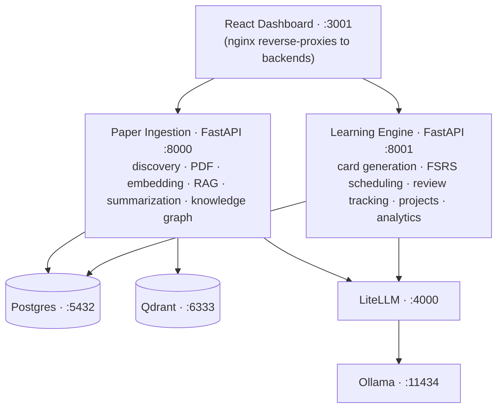

# JARVIS RD Assistant

> A self-hosted research workspace for paper discovery, evidence-grounded synthesis, PDF annotation, Zotero sync, and spaced repetition.

JARVIS RD Assistant helps researchers discover, organize, and interrogate scientific literature. It pairs local-first models with source-linked retrieval so generated claims can be traced back to papers in the researcher's library.

📖 **Docs:** https://ffidan.github.io/Jarvis-RD-Assistant/ &nbsp;·&nbsp; 📦 **Releases:** https://github.com/FFidan/Jarvis-RD-Assistant/releases &nbsp;·&nbsp; 🔒 **Security:** [SECURITY.md](https://github.com/FFidan/Jarvis-RD-Assistant/blob/main/SECURITY.md)

[](https://github.com/FFidan/Jarvis-RD-Assistant/actions/workflows/ci.yml)
[](https://github.com/FFidan/Jarvis-RD-Assistant/actions/workflows/docs.yml)
[](https://github.com/FFidan/Jarvis-RD-Assistant/blob/main/LICENSE)
[](https://www.python.org/downloads/)


## Highlights

- 📰 **Research Feed** — daily ranked briefings from arXiv, OpenAlex, Semantic Scholar, and PubMed, with per-topic Pulse digests delivered at the time you choose.
- 💬 **Ask** — cross-paper RAG over your library with inline citations and verified quote spans.
- 🧠 **Cards** — FSRS spaced-repetition for long-term retention of paper findings.
- 📂 **Projects** — lightweight task + milestone tracking tied to source papers, with optional Zotero push.

<details markdown="1">
<summary><b>More screenshots</b> — Dashboard · Pulse · Library · Discover · Knowledge Graph · Ask</summary>

| Dashboard | Pulse Deck |
|---|---|
|  |  |
| **Library (inbox)** | **Discover (multi-source)** |
|  |  |
| **Knowledge Graph** | **Ask (cross-paper Q&A)** |
|  |  |

</details>

## Quickstart

**Before you start:**

- Docker Engine 24+ with Compose v2, `openssl`, `git`
- ~20 GB free disk space
- NVIDIA GPU optional. On GPU, the first paper analysis takes a few minutes; on CPU-only it can take 30 minutes or more. The first run pulls 7–11 GB of model data; allow 20–60 minutes on a typical connection.
- On macOS, Docker containers cannot use the Apple GPU — expect CPU-speed analysis; allocate ≥8 GB to Docker Desktop.
- `./setup.sh --check` verifies all of these (read-only preflight)
- **Windows:** use WSL2 + Docker Desktop
- **Non-interactive installs:** use `scripts/jarvis-setup.sh` for CI / cloud-init

```bash
git clone https://github.com/FFidan/Jarvis-RD-Assistant.git
cd Jarvis-RD-Assistant
./setup.sh --check   # preflight (read-only, exits 0 on pass)
./setup.sh
```

`setup.sh` generates strong random secrets, brings the Docker Compose stack up, waits for the dashboard, and opens **http://localhost:3001** — the first-run wizard creates the admin account. Pass `--mode single` (API-key login, no SMTP) or `--mode multi` (magic-link email). See [docs/DEPLOYMENT.md](docs/DEPLOYMENT.md#single-user-vs-multi-user-mode) for the trade-off.

Re-running `./setup.sh` keeps your data: answering `N` (the default) at the `Overwrite?` prompt preserves your existing `.env` — secrets, database, and model choices — and simply starts the stack with that configuration. On first install the model download (7–11 GB; 20–60 min on a typical connection) streams its progress directly to your terminal before the services start, so the initial pull shows visible progress instead of a silent wait.

In single-user mode (`JARVIS_SETUP_MODE=single`), SMTP is optional: if unconfigured the login page defaults to the API-key tab and magic-link delivery is skipped.

**Non-interactive (CI / cloud-init):**

```bash
./setup.sh --non-interactive --profile=dev  # local dev / CI smoke test

./setup.sh --non-interactive --domain=jarvis.example.com \
  --admin-email=ops@example.com --profile=letsencrypt \
  --smtp-host=smtp.resend.com --smtp-user=resend \
  --smtp-pass-file=/run/secrets/smtp_pass
```

See `./setup.sh --help` for all flags (including `--profile=local-https` for self-signed TLS). After the first admin exists, invite teammates at **Admin → User Management**.

## What it does

Runs on your own hardware with Ollama, with optional cloud-model access through LiteLLM. It is designed for researchers who want literature workflows with visible sources and inspectable evidence.

**Core subsystems:**

- **Research Pulse** — multi-source paper discovery (arXiv, Semantic Scholar, OpenAlex, PubMed), PDF ingestion, verified summaries with exact-quote backing, cross-paper RAG Q&A.
- **Learning Engine** — flashcard generation from paper findings, FSRS spaced-repetition scheduling, retention analytics.
- **Project Manager** — tasks, milestones, paper-linking, deadline warnings, optional Zotero push.
- **My Day** — triage dashboard: daily counters, top-3 Pulse preview, Pomodoro timer, overdue action items, Learning/Project summaries.
- **Discovery** — overnight scoring of candidates via embedding similarity + LLM relevance ranking; 👍/👎/💾 feedback shapes tomorrow's deck.

### Design choices

- **Evidence grounding and verification.** Summaries, flashcard evidence, graph edges, Pulse reasoning, and RAG answer sentences are checked against retrieved source text. These checks improve traceability; they are not independent fact-checking and do not guarantee correctness.
- **Local-first deployment.** Ollama keeps model inference on infrastructure you control. If you configure a cloud provider through LiteLLM, relevant prompts and source excerpts are sent to that provider. See the [LLM tier benchmark](https://github.com/FFidan/Jarvis-RD-Assistant/blob/main/docs/perf/2026-05-22-llm-tier-bench.md) for model recommendations.
- **Hybrid search.** BM25 full-text search fused with Qdrant vector search via reciprocal rank fusion, then reranked with a cross-encoder for high-precision retrieval.

## Architecture



**Optional services:** Telegram bot (`--profile telegram`), Langfuse LLM-trace observability (off by default — `make observability-up`; see [docs/contracts/04-observability.md](https://github.com/FFidan/Jarvis-RD-Assistant/blob/main/docs/contracts/04-observability.md)).

## Deployment

Solo install: the **Quickstart** above is all you need. For team/multi-user setup, SMTP configuration, reverse-proxy / TLS (Caddy + Let's Encrypt or Cloudflare Tunnel), backups, upgrades, rollback, and remote access → **[docs/DEPLOYMENT.md](docs/DEPLOYMENT.md)**. End-user help (joining an existing instance) → **[User Guide](https://ffidan.github.io/Jarvis-RD-Assistant/manual/)**.

## Security

JARVIS applies user scoping at the application and query layers. The ops API key (`JARVIS_API_KEY`) is a service credential, not a user login. Application admins do not receive a research-data browsing interface for other users; infrastructure operators with database, filesystem, backup, or model-provider access remain inside the trust boundary.

See [SECURITY.md](https://github.com/FFidan/Jarvis-RD-Assistant/blob/main/SECURITY.md) for vulnerability disclosure and [docs/SECURITY.md](docs/SECURITY.md) for the full threat model, dev-flag behaviour, secret environment-variable reference, audit-log coverage, and operational hardening checklist.

## Development

### Prerequisites: Python 3.12+, Node.js 20+, Docker Engine 24+ with Compose v2, [`uv`](https://docs.astral.sh/uv/).

Install `uv` (Python package manager used for all backend tooling):

```bash
curl -LsSf https://astral.sh/uv/install.sh | sh
```

### Local setup

We strictly use Docker Compose for local development to avoid polluting the host with heavy ML dependencies.

```bash
docker compose up -d                    # Start local development services
docker compose logs -f paper_ingestion  # Follow logs
docker compose exec paper_ingestion pytest tests/  # Run a service's tests
docker compose exec paper_ingestion ruff check .   # Lint one service
```

Install Python dev dependencies, then run the full quality gate:

```bash
make dev-env   # uv sync --group dev
make check     # runs tach, pyright, test-shape, burned-secret guards, pytest, and frontend checks
```

The canonical pre-push gate is **`make check`** — the same set CI runs. The `docker compose exec` commands above are for quick, scoped iteration on a single service.

### Configuration

| Variable | Description |
|----------|-------------|
| `POSTGRES_PASSWORD` | Database password |
| `JARVIS_API_KEY` | API key for backend auth. Must be ≥32 characters in production. Generate with `openssl rand -hex 32`. |
| `LITELLM_MASTER_KEY` | 32-byte hex key for LiteLLM admin endpoints (generated by `init-secrets.sh`). |
| `JARVIS_CONFIG_KEY` | Fernet key that encrypts per-user credentials (Zotero/SMTP/LLM keys) at rest in `user_config`. Generate with `python -c "from cryptography.fernet import Fernet; print(Fernet.generate_key().decode())"` (or auto-created by `init-secrets.sh`). |
| `ENVIRONMENT` | Set to `production` for any non-local deployment. |
| `OLLAMA_MODELS` | Models to pull on first start (default: `qwen3:8b,qwen3:4b,qwen3-embedding:4b`; ≥24 GB VRAM can add `qwen3:14b`). |
| `EMBEDDING_MODEL_NAME` | Human-readable embedding model stored on chunk metadata (default: `qwen3-embedding:4b`). |
| `EMBEDDING_DIMENSION` | Must match the embedding model (default: `2560`). |

See [`.env.example`](https://github.com/FFidan/Jarvis-RD-Assistant/blob/main/.env.example) for the full annotated list. For production deployments using Docker Secrets (`_FILE` variants), see [`secrets/README.md`](https://github.com/FFidan/Jarvis-RD-Assistant/blob/main/secrets/README.md).

### Adding a paper source

1. Create `services/paper_ingestion/paper_ingestion/sources/new_source.py`.
2. Implement the `PaperSource` abstract class from `base.py`.
3. Decorate with `@register_source`.
4. Add a row to the `paper_sources` table via the Settings UI.

### Project structure

```
├── services/
│   ├── paper_ingestion/   # FastAPI: paper fetch, PDF parse, chunk, embed, RAG
│   ├── learning_engine/   # FastAPI: FSRS cards, review scheduling, projects
│   └── telegram_bot/      # python-telegram-bot (optional profile)
├── frontend/              # React 19 + TypeScript + Vite + Shadcn/ui
├── libs/jarvis_common/    # Shared Python library (auth, DB helpers, LLM client)
├── db/
│   ├── init.sql           # PostgreSQL bedrock schema
│   └── migrations/        # Versioned schema changes (0102+; 0089–0101 folded into init.sql)
├── litellm/config.yaml    # LLM gateway routing (smart/fast/embed aliases)
├── docker-compose.yml     # All services
├── .env.example           # Configuration template
└── Makefile               # Dev convenience commands
```

### Optional integrations

**Telegram bot** — daily digests, Pulse rating buttons, RAG Q&A from your phone, FSRS review in chat. Enable with `docker compose --profile telegram up -d`; full setup + command list in the **[User Guide → Telegram](https://ffidan.github.io/Jarvis-RD-Assistant/manual/telegram/)**.

**Zotero** — sync papers between JARVIS and your citation manager (push on star+project-link, pull via browser extension). Configure in **Settings → Integrations**; full setup in the **[User Guide → Settings](https://ffidan.github.io/Jarvis-RD-Assistant/manual/settings/)**.

### Contributing

See [CONTRIBUTING.md](https://github.com/FFidan/Jarvis-RD-Assistant/blob/main/CONTRIBUTING.md) for branching, commit-message style, and the pull-request checklist. Issues filed via the [bug report](https://github.com/FFidan/Jarvis-RD-Assistant/blob/main/.github/ISSUE_TEMPLATE/bug_report.md) and [feature request](https://github.com/FFidan/Jarvis-RD-Assistant/blob/main/.github/ISSUE_TEMPLATE/feature_request.md) templates get triaged fastest. Security reports: see [SECURITY.md](https://github.com/FFidan/Jarvis-RD-Assistant/blob/main/SECURITY.md).

## Tech stack

| Layer | Technology |
|-------|-----------|
| **Frontend** | React 19, TypeScript, Vite, Shadcn/ui, TanStack Query v5, Zustand, React Router v7, Recharts, Cytoscape.js |
| **Backend** | FastAPI, Python 3.12, asyncpg, Pydantic v2 |
| **LLM Gateway** | LiteLLM (routes to Ollama, OpenAI, Anthropic, etc.) |
| **Local LLM** | Ollama (qwen3:8b, qwen3:4b, qwen3-embedding:4b) |
| **Database** | PostgreSQL 16 |
| **Vector DB** | Qdrant |
| **Spaced repetition** | fsrs (FSRS algorithm) |
| **Search** | BM25 + semantic fusion, cross-encoder reranking |
| **Scheduling** | APScheduler (built-in) |
| **Notifications** | Telegram Bot API (optional) |
| **Reverse proxy** | nginx (in dashboard container) |

## Inspiration and prior art

The Discovery & Pulse subsystem draws on ideas and patterns from:

- [ChatGPT Pulse](https://openai.com/index/introducing-chatgpt-pulse/) — async overnight research, morning card deck, ephemeral delivery, and feedback loop pattern.
- [zotero-arxiv-daily](https://github.com/TideDra/zotero-arxiv-daily) — using your existing library as a preference model via weighted centroid cosine similarity.
- [GPT Paper Assistant](https://github.com/tatsu-lab/gpt_paper_assistant) — two-axis LLM scoring (relevance + novelty) and author watchlists via Semantic Scholar IDs.
- [ArxivDigest](https://github.com/AutoLLM/ArxivDigest) — natural-language interest descriptions driving LLM relevance ranking.
- [Scholar Inbox](https://scholar-inbox.com) — per-user logistic regression classifier trained on embedding vectors.
- [Inciteful](https://inciteful.xyz) — citation graph algorithms (PageRank + Adamic/Adar) for paper discovery.
- [BERTopic](https://github.com/MaartenGr/BERTopic) — neural topic modeling with dynamic temporal topics.
- [OpenScholar](https://github.com/AkariAsai/OpenScholar) — iterative self-feedback RAG over scientific literature.
- [PaperQA2](https://github.com/Future-House/paper-qa) — metadata-aware embeddings and tool-based retrieval.

These projects are credited for the ideas and patterns that informed JARVIS's design, not for copied code. All are MIT/Apache-licensed.

## Troubleshooting

See **[docs/DEPLOYMENT.md → Troubleshooting](docs/DEPLOYMENT.md#troubleshooting)** for the full troubleshooting guide (Ollama first-boot, migration failures, GPU detection, Pulse timeouts, dashboard network errors, first-run wizard, Telegram pairing, and more).

## Further reading

- [docs/DEPLOYMENT.md](docs/DEPLOYMENT.md) — single-source operator guide: deployment modes, TLS, tunnels, backups, troubleshooting.
- [docs/PRD.md](https://github.com/FFidan/Jarvis-RD-Assistant/blob/main/docs/PRD.md) — product requirements and feature-level spec, including the Discovery & Pulse design.
- [docs/REQUIREMENTS.md](docs/REQUIREMENTS.md) — non-functional requirements and technical constraints.
- [docs/perf/](https://github.com/FFidan/Jarvis-RD-Assistant/tree/main/docs/perf) — empirical model recommendations per hardware tier.
- [CHANGELOG.md](https://github.com/FFidan/Jarvis-RD-Assistant/blob/main/CHANGELOG.md) — release notes per version.

## Methods and limitations

“Verified” means that the system matched a generated statement or quote to retrieved source text. It does not mean that the underlying paper is correct, that the statement was independently reproduced, or that the output is free of omissions or interpretation errors. Retrieval quality depends on the ingested corpus, PDF extraction, model choice, and configuration. The Consensus and Extraction Table features are research aids, not substitutes for a systematic review, meta-analysis, or expert judgment.

See [Methods and limitations](docs/METHODS_AND_LIMITATIONS.md) for verification semantics, data-flow boundaries, and appropriate use.

## Authorship and AI-assisted development

JARVIS RD Assistant is maintained and copyrighted by Ferhat Fidan
<jarvis-rd@limitcycle.dev>. It was built with substantial AI-assisted
development, primarily using Claude Code. The Git history keeps
`Co-Authored-By: Claude ...` trailers where they accurately record AI-assisted
work.

Ferhat Fidan remains responsible for reviewing, accepting, maintaining, and
licensing the project. AI tools are disclosed for provenance; they are not listed
as project copyright holders. See [AUTHORS.md](AUTHORS.md).

Changes are checked with `ruff`, `pyright`, `tach` module-boundary checks,
Python and frontend tests, database-backed contract tests, and cross-user
isolation tests. GitHub-hosted CI runs for public-repository changes; the
corresponding local gate is `make check`. Mocked end-to-end and scheduled
model-pipeline smoke tests provide additional, non-equivalent coverage.

## License

[Apache 2.0](https://github.com/FFidan/Jarvis-RD-Assistant/blob/main/LICENSE).
The root LICENSE file is the canonical Apache-2.0 text; project copyright,
contact, authorship, and third-party notices are recorded in [NOTICE](NOTICE)
and [AUTHORS.md](AUTHORS.md).
