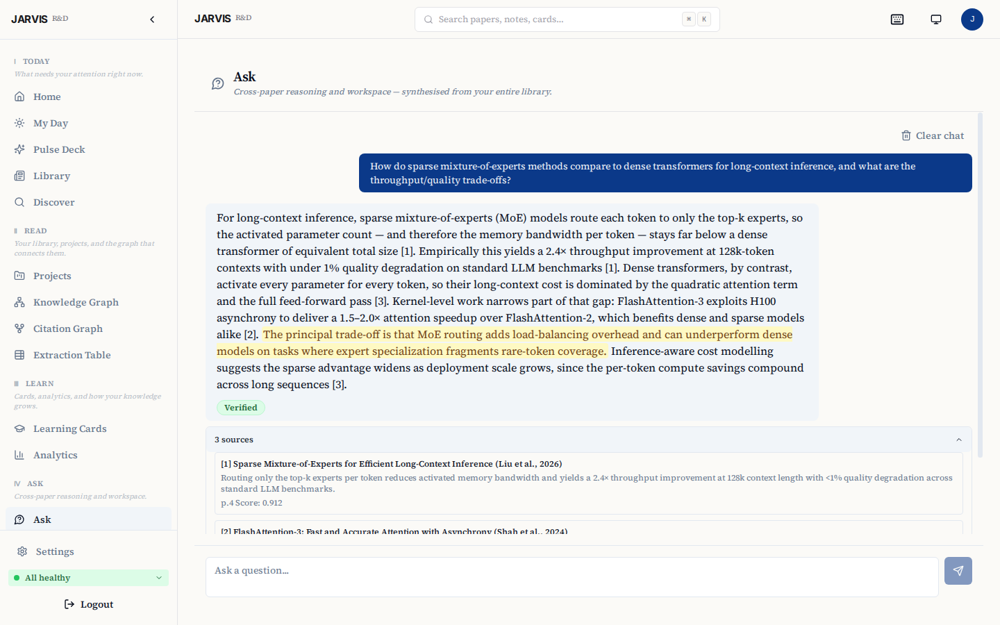
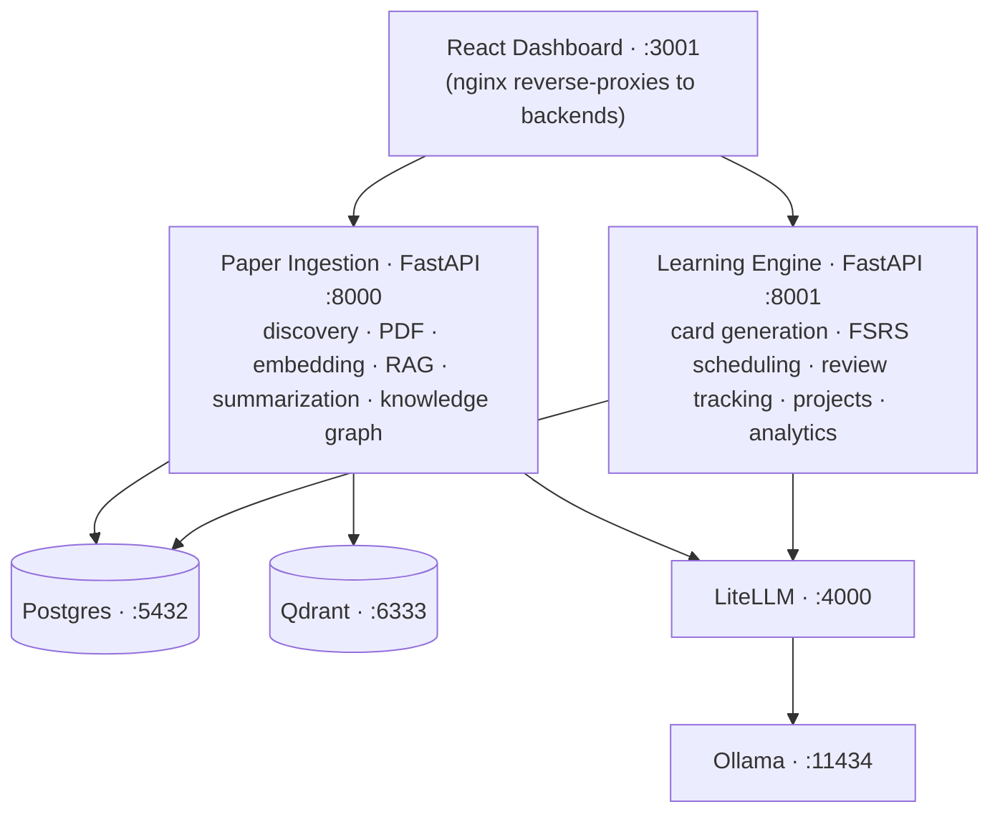

# JARVIS RD Assistant

> A self-hosted AI research workspace for literature discovery, evidence-grounded synthesis, PDF and Zotero workflows, spaced repetition, and research-project organization.

**Why it's different:**

- **Local-first** — runs on your own hardware with Ollama; your library and your questions never have to leave the machine.
- **Source-verified** — every generated claim links back to the retrieved text it came from, so you can check the evidence, not just trust the model.
- **Discover, understand, retain** — a daily ranked feed (Pulse), cross-paper Q&A with citations (Ask), and spaced-repetition Cards form one loop from finding a paper to remembering it.

JARVIS RD Assistant helps researchers discover, organize, and interrogate scientific literature. It defaults to local Ollama inference on infrastructure you control, uses source-linked retrieval so generated claims can be traced back to papers in the researcher's library, and can optionally use cloud models through LiteLLM when an administrator configures them.

**Docs:** https://limitcycle-oss.github.io/jarvis-rd-assistant/ &nbsp;·&nbsp; **Releases:** https://github.com/limitcycle-oss/jarvis-rd-assistant/releases &nbsp;·&nbsp; **Security:** [SECURITY.md](https://github.com/limitcycle-oss/jarvis-rd-assistant/blob/main/SECURITY.md)

[](https://github.com/limitcycle-oss/jarvis-rd-assistant/actions/workflows/ci.yml)
[](https://github.com/limitcycle-oss/jarvis-rd-assistant/actions/workflows/docs.yml)
[](https://github.com/limitcycle-oss/jarvis-rd-assistant/blob/main/LICENSE)
[](https://www.python.org/downloads/)


## Highlights

- **Research Feed** — daily ranked briefings from arXiv, OpenAlex, Semantic Scholar, and PubMed, with per-topic Pulse digests delivered at the time you choose.
- **Ask** — cross-paper RAG over your library with inline citations and verified quote spans.
- **Cards** — FSRS spaced-repetition for long-term retention of paper findings.
- **Projects** — lightweight task + milestone tracking tied to source papers, with optional Zotero push.

<details markdown="1">
<summary><b>More screenshots</b> — Dashboard · Pulse · Library · Discover · Knowledge Graph · Ask</summary>

| Dashboard | Pulse Deck |
|---|---|
|  |  |
| **Library (inbox)** | **Discover (multi-source)** |
|  |  |
| **Knowledge Graph** | **Ask (cross-paper Q&A)** |
|  |  |

</details>

## Quickstart

```bash
git clone https://github.com/limitcycle-oss/jarvis-rd-assistant.git
cd jarvis-rd-assistant
./setup.sh
```

New here? The **[Quick start guide](docs/manual/quickstart.md)** walks you from clone to your first analyzed paper in one screen. The **[Deployment guide](docs/DEPLOYMENT.md)** covers GPUs, remote and family access, and non-interactive installs in full.

**Before you start:**

- Docker Engine 24+ with Compose v2.24.4+, Python 3, `openssl`, `curl`, `git`
- **~27–54 GB free disk space** for a default first install — a one-time peak, not the ongoing footprint. The exact figure depends on the tier-selected model and whether images are pulled prebuilt or built locally; custom models may require more. See [Disk budget](docs/REQUIREMENTS.md#disk-budget).
- GPU optional. NVIDIA (CUDA) is the fully supported acceleration path — on GPU, the first paper analysis takes a few minutes; on CPU-only it can take 30 minutes or more. By default `setup.sh` **pulls** prebuilt application images from `ghcr.io/limitcycle-oss/jarvis-*` (no local build), then downloads the Ollama model set for your hardware tier (roughly 7 GB on the smallest tier, up to 23 GB on the largest) — allow more time on a typical connection for larger tiers. Contributors and forks can build from source instead with `./setup.sh --build-local`.
- AMD ROCm is selected only when `/dev/kfd` is available. Other AMD and Intel hosts stay on the supported CPU path unless Vulkan is selected explicitly with `./setup.sh --gpu vulkan`. Both ROCm and Vulkan remain experimental, and PDF parsing and reranking stay on CPU. See the [hardware support matrix](https://limitcycle-oss.github.io/jarvis-rd-assistant/manual/hardware-support-matrix/).
- On macOS, Docker containers cannot use the Apple GPU — expect CPU-speed analysis; allocate ≥8 GB to Docker Desktop.
- Setup checks Docker, Compose, OpenSSL, Python, ports, disk, and hardware. On supported hosts it can install missing packages after showing the commands and asking permission. `./setup.sh --check` runs the same preflight without making changes.
- **Windows:** use WSL2 + Docker Desktop
- **Non-interactive installs:** use `./setup.sh --non-interactive` for the full installer. `scripts/jarvis-setup.sh` is a local-only compatibility bootstrap for older CI jobs; it does not configure TLS or remote access.

`setup.sh` generates the repository-controlled secrets and configuration, pulls
the selected images and Ollama models, waits for the services, and prints one
finish-setup link. Its access chooser covers this computer, a guided private
HTTPS address for family devices, LAN diagnostics, Cloudflare Tunnel, and a
domain with Let's Encrypt.

Choose the sign-in preference: single-user mode puts API-key login first;
multi-user mode puts email magic links first. Accounts and private libraries are
isolated in either mode. SMTP is optional: without it, an administrator can
create a one-time invite and share it privately. Family sessions and passkeys
require the final named HTTPS address. Continue with [First sign-in and
setup](docs/manual/getting-started.md).

Setup handles JARVIS configuration for the selected route. For Tailscale, it can
preview and offer the official package install on supported Linux hosts; other
hosts receive manual guidance. Account sign-in, Cloudflare configuration, DNS,
and router changes still require the account or network owner.

Prefer not to open a terminal? Double-click a launcher in `launchers/` — `Start JARVIS.command` (macOS), `jarvis.desktop` (Linux), or `Start JARVIS.bat` (Windows) — each runs the same `setup.sh` and keeps the window open so you can read its output.

Re-running `./setup.sh` keeps the current configuration by default and restarts
that stack. To change the access route, accept the **Overwrite** prompt (or use
`--overwrite-env`). Papers, accounts, secrets, and operator-added settings stay
in place. Setup snapshots its configuration and setup-managed credentials,
accepts the new route only after its exact health marker and readiness gates
pass, and restores the last verified route if a change fails. An interrupted
change resumes safely the next time setup runs. If automated recovery cannot be
verified, setup stops and prints exact operator steps; see [Changing access
routes safely](docs/DEPLOYMENT.md#changing-access-routes-safely).

**Everyday commands.** Setup puts a `jarvis-research` launcher on your PATH for day-to-day operation from any directory:

```bash
jarvis-research status     # container status at a glance
jarvis-research logs -f     # follow service logs
jarvis-research doctor      # read-only health, disk, and update check
jarvis-research update      # transactional, database-safe upgrade to the latest release
```

See the [command-line reference](docs/manual/cli.md) for updates, recovery, and
contained uninstall options.

**Non-interactive (CI / cloud-init):**

`./setup.sh --non-interactive` is the supported unattended installer. It uses
the same prerequisite, access-mode, TLS, and final verification gates as the
interactive path.

```bash
./setup.sh --non-interactive --profile=dev  # local dev / CI smoke test

umask 077
printf '%s' "$MY_SMTP_PASS" > ./smtp-password.txt
./setup.sh --non-interactive --domain=jarvis.example.com \
  --admin-email=ops@example.com --profile=letsencrypt \
  --smtp-host=smtp.resend.com --smtp-user=resend \
  --smtp-pass-file=./smtp-password.txt
rm ./smtp-password.txt
```

See `./setup.sh --help` for unattended and advanced flags. Interactive setup is
the supported path for a first install.

## What it does

Runs on your own hardware with Ollama, with optional cloud-model access through LiteLLM. It is designed for researchers who want literature workflows with visible sources and inspectable evidence.

**Core subsystems:**

- **Research Pulse** — multi-source paper discovery (arXiv, Semantic Scholar, OpenAlex, PubMed), PDF ingestion, verified summaries with exact-quote backing, cross-paper RAG Q&A.
- **Learning Engine** — flashcard generation from paper findings, FSRS spaced-repetition scheduling, retention analytics.
- **Project Manager** — tasks, milestones, paper-linking, deadline warnings, optional Zotero push.
- **My Day** — triage dashboard: daily counters, top-3 Pulse preview, Pomodoro timer, overdue action items, Learning/Project summaries.
- **Discovery** — overnight scoring of candidates via embedding similarity and LLM relevance ranking; save and rating feedback shapes tomorrow's deck.

### Design choices

- **Evidence grounding and verification.** Summaries, flashcard evidence, graph edges, Pulse reasoning, and RAG answer sentences are checked against retrieved source text. These checks improve traceability; they are not independent fact-checking and do not guarantee correctness.
- **Local-first, not cloud-excluding.** Default model inference runs through Ollama on infrastructure you control. If an administrator configures a cloud provider through LiteLLM, the prompts and source excerpts needed for the selected task are sent to that provider. Offline behavior is feature-specific: cached reading and review workflows can remain usable without external network access, while discovery feeds need upstream APIs and generation requires the local stack plus the configured model backend.
- **Hybrid search.** BM25 full-text search fused with Qdrant vector search via reciprocal rank fusion, then reranked with a cross-encoder for high-precision retrieval.

## Architecture



**Optional services:** Telegram bot (`--profile telegram`), Langfuse LLM-trace observability (off by default — `make observability-up`; see [docs/contracts/04-observability.md](https://github.com/limitcycle-oss/jarvis-rd-assistant/blob/main/docs/contracts/04-observability.md)).

## Deployment

The Quickstart above is the normal install path. The [deployment
guide](docs/DEPLOYMENT.md) covers supported access choices and troubleshooting;
the [User Guide](https://limitcycle-oss.github.io/jarvis-rd-assistant/manual/)
covers first sign-in, family invitations, passkeys, and everyday use.

## Updating JARVIS

Installations running v1.2.0 or later use the normal lifecycle command:

```bash
jarvis-research update
```

This is the transactional, database-safe upgrade path. It checks that release images are available, requires a fresh verified backup before a data-changing migration, and waits for the stack to become healthy.

For an installation still running v1.1.3, v1.2.0 or v1.2.1, run the v1.2.2
bootstrap once from the installation directory:

```bash
(
  set -e
  bootstrap="$(mktemp)"
  trap 'rm -f "$bootstrap"' EXIT
  curl -fsSL -o "$bootstrap" \
    https://raw.githubusercontent.com/limitcycle-oss/jarvis-rd-assistant/v1.2.2/scripts/update-bootstrap.sh
  bash "$bootstrap" --repo "$PWD" --to v1.2.2
)
```

Those lifecycle commands predate the backup protocol required by v1.2.2. The
bootstrap validates the selected release and runs its updater, which creates
and authenticates a complete restore point before any data-changing migration.
See the [command-line
reference](docs/manual/cli.md#updating-from-a-release-before-v122) for the
complete update procedure and its repair-only manual fallback.

## Uninstalling JARVIS

`jarvis-research uninstall` lists the exact resources selected by each teardown
tier and confirms before acting. Preview the full plan first:

```bash
jarvis-research uninstall --dry-run --all   # enumerate a full teardown, change nothing
```

Data and purge tiers are irreversible. `--all` only selects the purge tier: the
ordinary confirmation and the backup offer still run, and only `--yes` suppresses
those two. The typed confirmations cannot be bypassed by either flag, and a purge
offers to export the backup encryption key first. `--keep-images` removes
everything the tier covers except images, which also lets a teardown finish when
the recorded version cannot be read. A non-interactive run without `--yes` stops
at the first confirmation and exits 0 having changed nothing, so check its output
rather than only its exit status. Read
[Uninstalling](docs/manual/cli.md#uninstalling) before selecting a tier.

## Security

JARVIS applies user scoping at the application and query layers. The operations
API key can bootstrap a session only for the configured instance owner; it is
not a shared credential for other users. Application administrators do not
receive a research-data browsing interface for another user's private work.
Infrastructure operators with database, filesystem, backup, or model-provider
access remain inside the trust boundary.

See [SECURITY.md](https://github.com/limitcycle-oss/jarvis-rd-assistant/blob/main/SECURITY.md) for vulnerability disclosure and [docs/SECURITY.md](docs/SECURITY.md) for the full threat model, dev-flag behaviour, secret environment-variable reference, audit-log coverage, and operational hardening checklist.

## Development

### Prerequisites: Python 3.12+, Node.js 20+, Docker Engine 24+ with Compose v2, [`uv`](https://docs.astral.sh/uv/).

Install `uv` (Python package manager used for all backend tooling):

```bash
curl -LsSf https://astral.sh/uv/install.sh | sh
```

### Local setup

We strictly use Docker Compose for local development to avoid polluting the host with heavy ML dependencies.

```bash
docker compose up -d                    # Start local development services
docker compose logs -f paper_ingestion  # Follow logs
docker compose exec paper_ingestion pytest tests/  # Run a service's tests
docker compose exec paper_ingestion ruff check .   # Lint one service
```

Install Python dev dependencies, then run the full quality gate:

```bash
make dev-env   # uv sync --group dev
make check     # runs tach, pyright, test-shape, burned-secret guards, pytest, and frontend checks
```

The canonical pre-push gate is **`make check`** — the same set CI runs. The `docker compose exec` commands above are for quick, scoped iteration on a single service.

### Configuration

| Variable | Description |
|----------|-------------|
| `POSTGRES_PASSWORD` | Database password |
| `JARVIS_API_KEY` | API key for backend auth. Must be ≥32 characters in production. Generate with `openssl rand -hex 32`. |
| `LITELLM_MASTER_KEY` | 32-byte hex key for LiteLLM admin endpoints (generated by `init-secrets.sh`). |
| `JARVIS_CONFIG_KEY` | Fernet key that encrypts database-backed integration settings at rest. Their scopes differ: provider, SMTP, and Telegram-bot settings are deployment-wide, while Zotero credentials are per-user. Generate with `python -c "from cryptography.fernet import Fernet; print(Fernet.generate_key().decode())"` (or auto-created by `init-secrets.sh`). |
| `ENVIRONMENT` | Setup selects `production` for every off-host authenticated HTTPS route: Tailscale, Cloudflare Tunnel, Let's Encrypt, or a named `--public-origin`. Loopback-only localhost/local-HTTPS and LAN diagnostics use `development`. |
| `OLLAMA_MODELS` | Models pulled on first start. `setup.sh` writes a tier-selected set; `.env.example` keeps `qwen3:8b,qwen3:4b,qwen3-embedding:4b` only as the manual template fallback. |
| `EMBEDDING_MODEL_NAME` | Human-readable embedding model stored on chunk metadata (default: `qwen3-embedding:4b`). |
| `EMBEDDING_DIMENSION` | Must match the embedding model (default: `2560`). |

See [`.env.example`](https://github.com/limitcycle-oss/jarvis-rd-assistant/blob/main/.env.example) for the full annotated list. For production deployments using Docker Secrets (`_FILE` variants), see [`secrets/README.md`](https://github.com/limitcycle-oss/jarvis-rd-assistant/blob/main/secrets/README.md).

### Adding a paper source

1. Create `services/paper_ingestion/paper_ingestion/sources/new_source.py`.
2. Implement the `PaperSource` abstract class from `base.py`.
3. Decorate with `@register_source`.
4. Add a row to the `paper_sources` table via the Settings UI.

### Project structure

```
├── services/
│   ├── paper_ingestion/   # FastAPI: paper fetch, PDF parse, chunk, embed, RAG
│   ├── learning_engine/   # FastAPI: FSRS cards, review scheduling, projects
│   └── telegram_bot/      # python-telegram-bot (optional profile)
├── frontend/              # React 19 + TypeScript + Vite + Shadcn/ui
├── libs/jarvis_common/    # Shared Python library (auth, DB helpers, LLM client)
├── db/
│   ├── init.sql           # PostgreSQL bedrock schema
│   └── migrations/        # Post-baseline ledger; see db/migrations/README.md
├── litellm/config.yaml    # LLM gateway routing (embed alias; smart/fast are DB-managed by the boot reconciler)
├── docker-compose.yml     # All services
├── .env.example           # Configuration template
└── Makefile               # Dev convenience commands
```

### Optional integrations

**Telegram bot** — daily digests, Pulse rating buttons, RAG Q&A from your phone, FSRS review in chat. Enable with `docker compose --profile telegram up -d`; full setup + command list in the **[User Guide → Telegram](https://limitcycle-oss.github.io/jarvis-rd-assistant/manual/telegram/)**.

**Zotero** — sync papers between JARVIS and your citation manager (push on star+project-link, pull via browser extension). Configure in **Settings → Integrations**; full setup in the **[User Guide → Settings](https://limitcycle-oss.github.io/jarvis-rd-assistant/manual/settings/)**.

### Contributing

See [CONTRIBUTING.md](https://github.com/limitcycle-oss/jarvis-rd-assistant/blob/main/CONTRIBUTING.md) for branching, commit-message style, and the pull-request checklist. Issues filed via the [bug report](https://github.com/limitcycle-oss/jarvis-rd-assistant/blob/main/.github/ISSUE_TEMPLATE/bug_report.md) and [feature request](https://github.com/limitcycle-oss/jarvis-rd-assistant/blob/main/.github/ISSUE_TEMPLATE/feature_request.md) templates get triaged fastest. Security reports: see [SECURITY.md](https://github.com/limitcycle-oss/jarvis-rd-assistant/blob/main/SECURITY.md).

## Tech stack

| Layer | Technology |
|-------|-----------|
| **Frontend** | React 19, TypeScript, Vite, Shadcn/ui, TanStack Query v5, Zustand, React Router v7, Recharts, Cytoscape.js |
| **Backend** | FastAPI, Python 3.12, asyncpg, Pydantic v2 |
| **LLM Gateway** | LiteLLM (routes to Ollama and optional configured cloud providers) |
| **Local LLM** | Ollama (tier-selected Qwen smart model, qwen3:4b quick model, qwen3-embedding:4b embedder) |
| **Database** | PostgreSQL 16 |
| **Vector DB** | Qdrant |
| **Spaced repetition** | fsrs (FSRS algorithm) |
| **Search** | BM25 + semantic fusion, cross-encoder reranking |
| **Scheduling** | APScheduler (built-in) |
| **Notifications** | Telegram Bot API (optional) |
| **Reverse proxy** | nginx (in dashboard container) |

## Inspiration and prior art

The Discovery & Pulse subsystem draws on ideas and patterns from:

- [ChatGPT Pulse](https://openai.com/index/introducing-chatgpt-pulse/) — async overnight research, morning card deck, ephemeral delivery, and feedback loop pattern.
- [zotero-arxiv-daily](https://github.com/TideDra/zotero-arxiv-daily) — using your existing library as a preference model via weighted centroid cosine similarity.
- [GPT Paper Assistant](https://github.com/tatsu-lab/gpt_paper_assistant) — two-axis LLM scoring (relevance + novelty) and author watchlists via Semantic Scholar IDs.
- [ArxivDigest](https://github.com/AutoLLM/ArxivDigest) — natural-language interest descriptions driving LLM relevance ranking.
- [Scholar Inbox](https://scholar-inbox.com) — per-user logistic regression classifier trained on embedding vectors.
- [Inciteful](https://inciteful.xyz) — citation graph algorithms (PageRank + Adamic/Adar) for paper discovery.
- [BERTopic](https://github.com/MaartenGr/BERTopic) — neural topic modeling with dynamic temporal topics.
- [OpenScholar](https://github.com/AkariAsai/OpenScholar) — iterative self-feedback RAG over scientific literature.
- [PaperQA2](https://github.com/Future-House/paper-qa) — metadata-aware embeddings and tool-based retrieval.

These projects are credited for the ideas and patterns that informed JARVIS's design, not for copied code. All are MIT/Apache-licensed.

## Troubleshooting

See **[docs/DEPLOYMENT.md → Troubleshooting](docs/DEPLOYMENT.md#troubleshooting)** for the full troubleshooting guide (Ollama first-boot, migration failures, GPU detection, Pulse timeouts, dashboard network errors, first-run wizard, Telegram pairing, and more).

## Further reading

- [docs/DEPLOYMENT.md](docs/DEPLOYMENT.md) — single-source operator guide: deployment modes, TLS, tunnels, backups, troubleshooting.
- [docs/PRD.md](https://github.com/limitcycle-oss/jarvis-rd-assistant/blob/main/docs/PRD.md) — product requirements and feature-level spec, including the Discovery & Pulse design.
- [docs/REQUIREMENTS.md](docs/REQUIREMENTS.md) — non-functional requirements and technical constraints.
- [docs/METHODS_AND_LIMITATIONS.md](docs/METHODS_AND_LIMITATIONS.md) — verification meaning, privacy boundaries, and evaluation limits.
- [CHANGELOG.md](https://github.com/limitcycle-oss/jarvis-rd-assistant/blob/main/CHANGELOG.md) — release notes per version.

## Methods and limitations

“Verified” means that the system matched a generated statement or quote to retrieved source text. It does not mean that the underlying paper is correct, that the statement was independently reproduced, or that the output is free of omissions or interpretation errors. Retrieval quality depends on the ingested corpus, PDF extraction, model choice, and configuration. The Consensus and Extraction Table features are research aids, not substitutes for a systematic review, meta-analysis, or expert judgment.

See [Methods and limitations](docs/METHODS_AND_LIMITATIONS.md) for verification semantics, data-flow boundaries, and appropriate use.

## Authorship and AI-assisted development

JARVIS RD Assistant is maintained and copyrighted by Ferhat Fidan
<jarvis-rd@limitcycle.dev>. It was built with substantial AI-assisted
development, primarily using Claude Code. The Git history keeps
`Co-Authored-By: Claude ...` trailers where they accurately record AI-assisted
work.

Ferhat Fidan remains responsible for reviewing, accepting, maintaining, and
licensing the project. AI tools are disclosed for provenance; they are not listed
as project copyright holders. See
[AUTHORS.md](https://github.com/limitcycle-oss/jarvis-rd-assistant/blob/main/AUTHORS.md).

Changes are checked with `ruff`, `pyright`, `tach` module-boundary checks,
Python and frontend tests, database-backed contract tests, and cross-user
isolation tests. GitHub-hosted CI runs for public-repository changes; the
corresponding local gate is `make check`. Mocked end-to-end and scheduled
model-pipeline smoke tests provide additional, non-equivalent coverage.

## License

[Apache 2.0](https://github.com/limitcycle-oss/jarvis-rd-assistant/blob/main/LICENSE).
The root LICENSE file is the canonical Apache-2.0 text; project copyright,
contact, authorship, and third-party notices are recorded in
[NOTICE](https://github.com/limitcycle-oss/jarvis-rd-assistant/blob/main/NOTICE)
and [AUTHORS.md](https://github.com/limitcycle-oss/jarvis-rd-assistant/blob/main/AUTHORS.md).
