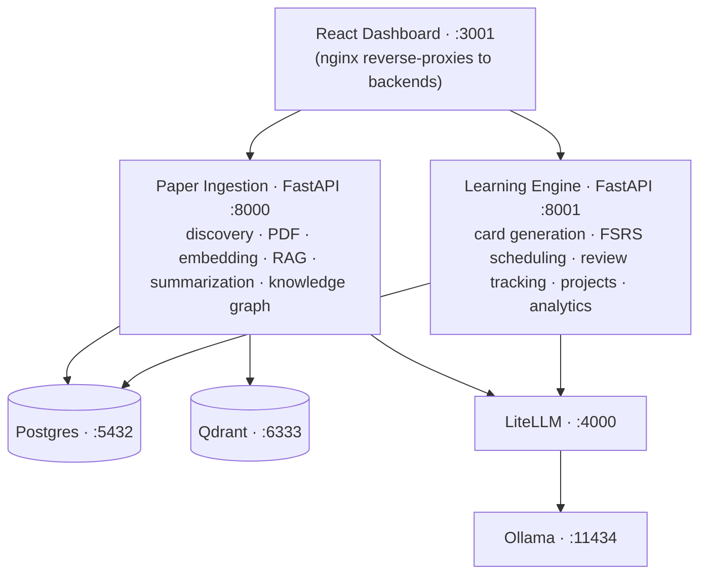

# JARVIS RD Assistant

> Self-hosted AI research assistant: citation-backed paper briefings, spaced-repetition learning, integrated project management. FastAPI + React + Postgres + Qdrant.

📖 **Docs:** https://ffidan.github.io/Jarvis-RD-Assistant/ &nbsp;·&nbsp; 📦 **Releases:** https://github.com/FFidan/Jarvis-RD-Assistant/releases &nbsp;·&nbsp; 🔒 **Security:** [SECURITY.md](SECURITY.md)

[](https://github.com/FFidan/Jarvis-RD-Assistant/actions/workflows/ci.yml)
[](https://github.com/FFidan/Jarvis-RD-Assistant/actions/workflows/docs.yml)
[](LICENSE)
[](https://www.python.org/downloads/)


## Highlights

- 📰 **Research Feed** — daily ranked briefings from arXiv, OpenAlex, Semantic Scholar, and PubMed, with per-topic Pulse digests delivered at the time you choose.
- 💬 **Ask** — cross-paper RAG over your library with inline citations and verified quote spans.
- 🧠 **Cards** — FSRS spaced-repetition for long-term retention of paper findings.
- 📂 **Projects** — lightweight task + milestone tracking tied to source papers, with optional Zotero push.

<details>
<summary><b>More screenshots</b> — Dashboard · Pulse · Library · Discover · Knowledge Graph</summary>

| Dashboard | Pulse Deck |
|---|---|
|  |  |
| **Library (inbox)** | **Discover (multi-source)** |
|  |  |
| **Knowledge Graph** | |
|  | |

</details>

## Quickstart

**Before you start:**

- Docker Engine 24+ with Compose v2, `openssl`, `git`
- ~20 GB free disk space
- NVIDIA GPU optional (CPU works fine)
- `./setup.sh --check` verifies all of these (read-only preflight)
- **Windows:** use WSL2 + Docker Desktop
- **Non-interactive installs:** use `scripts/jarvis-setup.sh` for CI / cloud-init

```bash
git clone https://github.com/FFidan/Jarvis-RD-Assistant.git
cd Jarvis-RD-Assistant
./setup.sh --check   # preflight (read-only, exits 0 on pass)
./setup.sh
```

`setup.sh` generates strong random secrets, configures TLS, brings the Docker Compose stack up, waits for the dashboard, and opens **http://localhost:3001** — the first-run wizard creates the admin account. Pass `--mode single` (API-key login, no SMTP) or `--mode multi` (magic-link email). See [docs/DEPLOYMENT.md](docs/DEPLOYMENT.md#single-user-vs-multi-user-mode) for the trade-off.

**Non-interactive (CI / cloud-init):**

```bash
./setup.sh --non-interactive --profile=dev  # local dev / CI smoke test

./setup.sh --non-interactive --domain=jarvis.example.com \
  --admin-email=ops@example.com --profile=letsencrypt \
  --smtp-host=smtp.resend.com --smtp-user=resend \
  --smtp-pass-file=/run/secrets/smtp_pass
```

See `./setup.sh --help` for all flags (including `--profile=local-https` for self-signed TLS). After the first admin exists, invite teammates at **Settings → Admin → Users**.

## What it does

Runs on your own hardware via Ollama (or cloud providers through LiteLLM). Designed for researchers tracking multiple topics who want an assistant that does not hallucinate.

**Core subsystems:**

- **Research Pulse** — multi-source paper discovery (arXiv, Semantic Scholar, OpenAlex, PubMed), PDF ingestion, verified summaries with exact-quote backing, cross-paper RAG Q&A.
- **Learning Engine** — flashcard generation from paper findings, FSRS spaced-repetition scheduling, retention analytics.
- **Project Manager** — tasks, milestones, paper-linking, deadline warnings, optional Zotero push.
- **My Day** — triage dashboard: daily counters, top-3 Pulse preview, Pomodoro timer, overdue action items, Learning/Project summaries.
- **Discovery** — overnight scoring of candidates via embedding similarity + LLM relevance ranking; 👍/👎/💾 feedback shapes tomorrow's deck.

### Design choices

- **Anti-hallucination pipeline.** Verified summaries, flashcard evidence, KG edges, Pulse reasoning, and RAG answer sentences are checked against retrieved source text. Weekly Summary separates verified from unverified themes. A conservative contradiction scanner persists only quote-backed conflicts.
- **Local-first.** Runs on Ollama with no cloud dependency. LiteLLM provides a unified gateway so you can swap between local and cloud models without code changes. See the [LLM tier benchmark](https://github.com/FFidan/Jarvis-RD-Assistant/blob/master/docs/perf/2026-05-22-llm-tier-bench.md) for tier-by-tier model recommendations.
- **Hybrid search.** BM25 full-text search fused with Qdrant vector search via reciprocal rank fusion, then reranked with a cross-encoder for high-precision retrieval.

## Architecture



**Optional services:** Telegram bot (`--profile telegram`), Langfuse LLM-trace observability (off by default — `make observability-up`; see [docs/contracts/04-observability.md](docs/contracts/04-observability.md)).

## Deployment

Solo install: the **Quickstart** above is all you need. For team/multi-user setup, SMTP configuration, reverse-proxy / TLS (Caddy + Let's Encrypt or Cloudflare Tunnel), backups, upgrades, rollback, and remote access → **[docs/DEPLOYMENT.md](docs/DEPLOYMENT.md)**. End-user help (joining an existing instance) → **[User Guide](https://ffidan.github.io/Jarvis-RD-Assistant/manual/)**.

## Security

JARVIS is multi-tenant: every user's research data is isolated at the query layer. The ops API key (`JARVIS_API_KEY`) is a service credential, not a user login. Admins manage users but cannot read other users' research data.

See [SECURITY.md](SECURITY.md) for vulnerability disclosure and [docs/SECURITY.md](docs/SECURITY.md) for the full threat model, dev-flag behaviour, secret environment-variable reference, audit-log coverage, and operational hardening checklist.

## Development

### Prerequisites: Python 3.12+, Node.js 20+, Docker Engine 24+ with Compose v2.

### Local setup

We strictly use Docker Compose for local development to avoid polluting the host with heavy ML dependencies.

```bash
docker compose up -d                    # Start all services
docker compose logs -f paper_ingestion  # Follow logs
docker compose exec paper_ingestion pytest tests/  # Run tests
docker compose exec paper_ingestion ruff check .   # Lint
```

### Configuration

| Variable | Description |
|----------|-------------|
| `POSTGRES_PASSWORD` | Database password |
| `JARVIS_API_KEY` | API key for backend auth. Must be ≥32 characters in production. Generate with `openssl rand -hex 32`. |
| `LITELLM_MASTER_KEY` | 32-byte hex key for LiteLLM admin endpoints (generated by `init-secrets.sh`). |
| `ENVIRONMENT` | Set to `production` for any non-local deployment. |
| `OLLAMA_MODELS` | Models to pull on first start (default: `qwen3:8b,qwen3:4b,qwen3-embedding:4b`; ≥24 GB VRAM can add `qwen3:14b`). |
| `EMBEDDING_MODEL_NAME` | Human-readable embedding model stored on chunk metadata (default: `qwen3-embedding:4b`). |
| `EMBEDDING_DIMENSION` | Must match the embedding model (default: `2560`). |

See [`.env.example`](.env.example) for the full annotated list. For production deployments using Docker Secrets (`_FILE` variants), see [`secrets/README.md`](secrets/README.md).

### Adding a paper source

1. Create `services/paper_ingestion/paper_ingestion/sources/new_source.py`.
2. Implement the `PaperSource` abstract class from `base.py`.
3. Decorate with `@register_source`.
4. Add a row to the `paper_sources` table via the Settings UI.

### Project structure

```
├── services/
│   ├── paper_ingestion/   # FastAPI: paper fetch, PDF parse, chunk, embed, RAG
│   ├── learning_engine/   # FastAPI: FSRS cards, review scheduling, projects
│   └── telegram_bot/      # python-telegram-bot (optional profile)
├── frontend/              # React 19 + TypeScript + Vite + Shadcn/ui
├── libs/jarvis_common/    # Shared Python library (auth, DB helpers, LLM client)
├── db/
│   ├── init.sql           # PostgreSQL bedrock schema
│   └── migrations/        # Versioned schema changes (starting 0089)
├── litellm/config.yaml    # LLM gateway routing (smart/fast/embed aliases)
├── docker-compose.yml     # All services
├── .env.example           # Configuration template
└── Makefile               # Dev convenience commands
```

### Optional integrations

**Telegram bot** — daily digests, Pulse rating buttons, RAG Q&A from your phone, FSRS review in chat. Enable with `docker compose --profile telegram up -d`; full setup + command list in the **[User Guide → Telegram](https://ffidan.github.io/Jarvis-RD-Assistant/manual/telegram/)**.

**Zotero** — sync papers between JARVIS and your citation manager (push on star+project-link, pull via browser extension). Configure in **Settings → Integrations**; full setup in the **[User Guide → Settings](https://ffidan.github.io/Jarvis-RD-Assistant/manual/settings/)**.

### Contributing

See [CONTRIBUTING.md](CONTRIBUTING.md) for branching, commit-message style, and the pull-request checklist. Issues filed via the [bug report](.github/ISSUE_TEMPLATE/bug_report.md) and [feature request](.github/ISSUE_TEMPLATE/feature_request.md) templates get triaged fastest. Security reports: see [SECURITY.md](SECURITY.md).

## Tech stack

| Layer | Technology |
|-------|-----------|
| **Frontend** | React 19, TypeScript, Vite, Shadcn/ui, TanStack Query v5, Zustand, React Router v7, Recharts, Cytoscape.js |
| **Backend** | FastAPI, Python 3.12, asyncpg, Pydantic v2 |
| **LLM Gateway** | LiteLLM (routes to Ollama, OpenAI, Anthropic, etc.) |
| **Local LLM** | Ollama (qwen3:8b, qwen3:4b, qwen3-embedding:4b) |
| **Database** | PostgreSQL 16 |
| **Vector DB** | Qdrant |
| **Spaced repetition** | py-fsrs (FSRS algorithm) |
| **Search** | BM25 + semantic fusion, cross-encoder reranking |
| **Scheduling** | APScheduler (built-in) |
| **Notifications** | Telegram Bot API (optional) |
| **Reverse proxy** | nginx (in dashboard container) |

## Inspiration and prior art

The Discovery & Pulse subsystem draws on ideas and patterns from:

- [ChatGPT Pulse](https://openai.com/index/introducing-chatgpt-pulse/) — async overnight research, morning card deck, ephemeral delivery, and feedback loop pattern.
- [zotero-arxiv-daily](https://github.com/TideDra/zotero-arxiv-daily) — using your existing library as a preference model via weighted centroid cosine similarity.
- [GPT Paper Assistant](https://github.com/tatsu-lab/gpt_paper_assistant) — two-axis LLM scoring (relevance + novelty) and author watchlists via Semantic Scholar IDs.
- [ArxivDigest](https://github.com/AutoLLM/ArxivDigest) — natural-language interest descriptions driving LLM relevance ranking.
- [Scholar Inbox](https://scholar-inbox.com) — per-user logistic regression classifier trained on embedding vectors.
- [Inciteful](https://inciteful.xyz) — citation graph algorithms (PageRank + Adamic/Adar) for paper discovery.
- [BERTopic](https://github.com/MaartenGr/BERTopic) — neural topic modeling with dynamic temporal topics.
- [OpenScholar](https://github.com/AkariAsai/OpenScholar) — iterative self-feedback RAG over scientific literature.
- [PaperQA2](https://github.com/Future-House/paper-qa) — metadata-aware embeddings and agentic retrieval.

These projects are credited for the ideas and patterns that informed JARVIS's design, not for copied code. All are MIT/Apache-licensed.

## Troubleshooting

See **[docs/DEPLOYMENT.md → Troubleshooting](docs/DEPLOYMENT.md#troubleshooting)** for the full troubleshooting guide (Ollama first-boot, migration failures, GPU detection, Pulse timeouts, dashboard network errors, first-run wizard, Telegram pairing, and more).

## Further reading

- [docs/DEPLOYMENT.md](docs/DEPLOYMENT.md) — single-source operator guide: deployment modes, TLS, tunnels, backups, troubleshooting.
- [docs/PRD.md](docs/PRD.md) — product requirements and feature-level spec, including the Discovery & Pulse design.
- [docs/REQUIREMENTS.md](docs/REQUIREMENTS.md) — non-functional requirements and technical constraints.
- [docs/perf/](https://github.com/FFidan/Jarvis-RD-Assistant/tree/master/docs/perf) — empirical model recommendations per hardware tier.
- [CHANGELOG.md](CHANGELOG.md) — release notes per version.
- [CONTRIBUTING.md](CONTRIBUTING.md) — how to contribute.
- [SECURITY.md](SECURITY.md) — vulnerability disclosure and threat model entry-point.

## Built with AI-assisted development

JARVIS RD Assistant was built with heavy AI-assisted development, kept honest by strict automated gates — `ruff`, `pyright`, `tach` module-boundary checks, the full test suite, and multi-tenant-isolation tests all run in CI on every change.

## License

[MIT](LICENSE)
